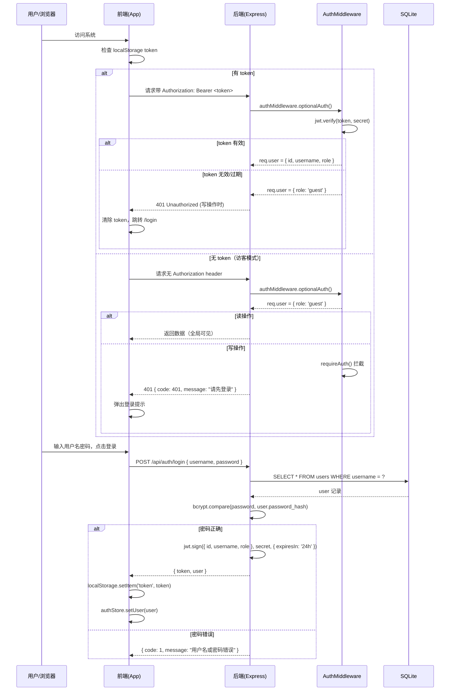
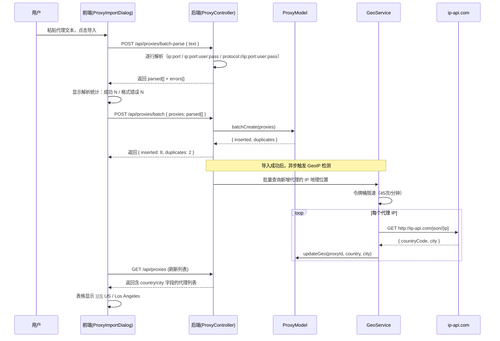
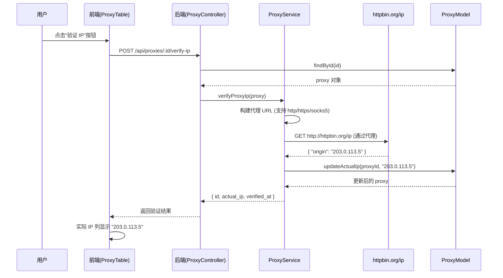
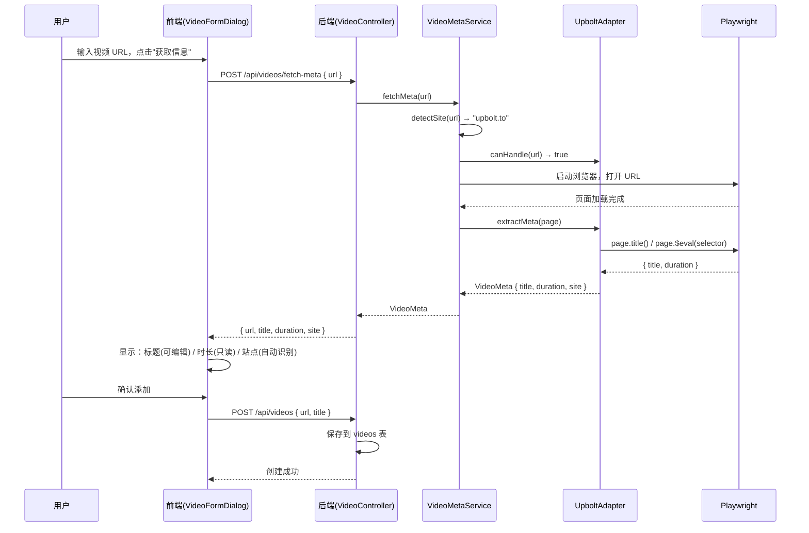
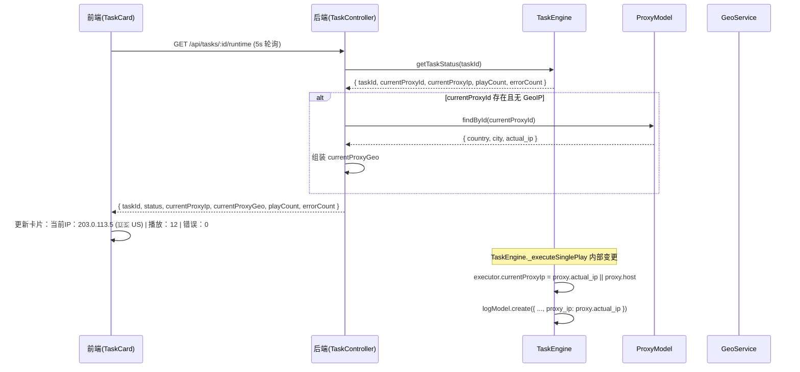
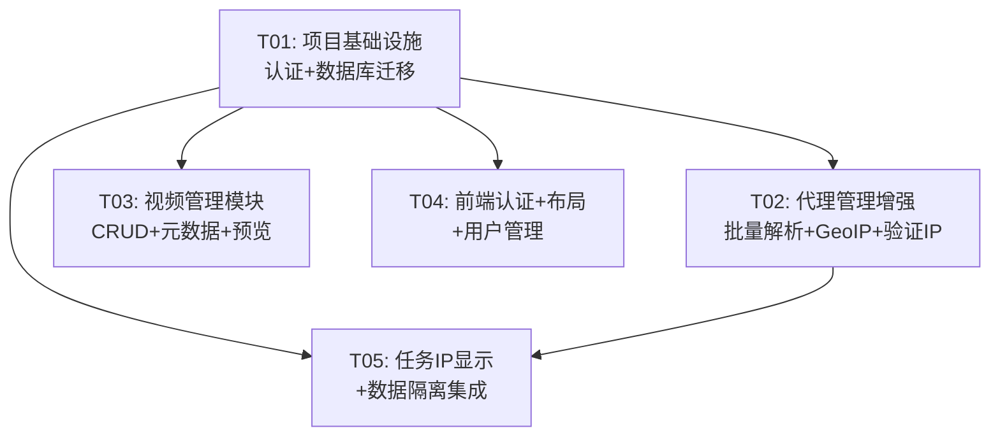

# 广告联盟系统 V2 — 增量架构设计

> 文档版本：1.0 | 日期：2025-07-25 | 作者：高见远（架构师）

---

## 一、实现方案概述

### 1.1 核心技术挑战

| 挑战 | 说明 | 应对方案 |
|------|------|----------|
| 用户体系从无到有 | 现有系统无认证机制，需加入 JWT 全链路鉴权，且不能破坏现有 API 契约 | authMiddleware 双模式：有 token 解析用户，无 token 标记访客；所有写操作需认证，读操作可选认证 |
| 数据迁移 | 现有 5 张表均无 user_id，需加列 + 数据回填 | 迁移脚本统一处理，现有数据归属 admin(user_id=1)；新增列均允许 NULL 兼容过渡期 |
| GeoIP 限速 | ip-api.com 免费版 45 次/分钟 | 后端 GeoService 内置令牌桶限速器，批量导入时队列化处理，不阻塞导入返回 |
| 视频元数据提取 | 不同站点 DOM 结构不同 | Site Adapter 模式，先实现 upbolt.to adapter，可扩展 |
| 任务执行显示代理 IP | TaskEngine 需在执行过程中记录当前代理 IP | 扩展 executor 对象增加 currentProxyIp 字段；logModel.create 增加 proxy_ip 参数 |

### 1.2 架构模式

- **后端**：沿用现有 MVC 分层（Route → Controller → Model/Service），新增 Middleware 层处理认证
- **前端**：沿用 Zustand + MUI 模式，新增 authStore 管理全局认证状态
- **认证**：JWT（HS256），24h 过期，前端 localStorage 存储，axios 拦截器自动注入 Authorization header
- **访客模式**：无 token 访问 → 后端标记 `req.user = { role: 'guest' }` → 只读 API 放行，写操作返回 401

### 1.3 框架与库选型

| 用途 | 选型 | 理由 |
|------|------|------|
| JWT 生成/验证 | jsonwebtoken | 成熟稳定，Express 生态标配 |
| 密码哈希 | bcryptjs | 纯 JS 实现，无需编译原生模块 |
| GeoIP 查询 | ip-api.com (HTTP) | 免费版满足需求，后端限速 |
| IP 验证 | httpbin.org/ip | 简单可靠，可配置化 |
| 视频元数据提取 | Playwright (现有) | 系统已集成 Playwright，复用现有浏览器实例 |

---

## 二、文件列表

### 2.1 后端新增文件

| 相对路径 | 说明 |
|----------|------|
| `server/middleware/authMiddleware.js` | JWT 验证中间件（含访客模式） |
| `server/controllers/authController.js` | 登录/登出/获取当前用户 |
| `server/controllers/videoController.js` | 视频 CRUD + 元数据抓取 |
| `server/controllers/userController.js` | 用户管理（管理员） |
| `server/routes/authRoutes.js` | 认证路由 |
| `server/routes/videoRoutes.js` | 视频路由 |
| `server/routes/userRoutes.js` | 用户管理路由 |
| `server/models/userModel.js` | 用户数据层 |
| `server/models/videoModel.js` | 视频数据层 |
| `server/services/geoService.js` | GeoIP 查询（含令牌桶限速） |
| `server/services/videoMetaService.js` | 视频元数据提取（Site Adapter 模式） |
| `server/services/siteAdapters/upboltAdapter.js` | upbolt.to 站点适配器 |
| `server/migrations/001_add_user_system.js` | 数据库迁移：新增 users 表、videos 表，现有表加列 |

### 2.2 后端修改文件

| 相对路径 | 修改内容 |
|----------|----------|
| `server/index.js` | 注册新路由，挂载 authMiddleware，注入 JWT_SECRET |
| `server/database.js` | 迁移逻辑调用入口 |
| `server/controllers/proxyController.js` | 增加批量解析、验证 IP、GeoIP 刷新接口 |
| `server/routes/proxyRoutes.js` | 注册新路由 |
| `server/models/proxyModel.js` | 增加 country/city/actual_ip/user_id 字段支持，按 user_id 筛选 |
| `server/models/taskModel.js` | 增加 user_id 字段支持，按 user_id 筛选 |
| `server/models/executionLogModel.js` | 增加 proxy_ip 字段写入和查询 |
| `server/models/earningsModel.js` | 增加 user_id 字段支持 |
| `server/services/taskEngine.js` | executor 增加 currentProxyIp；logModel.create 传入 proxy_ip；getTaskStatus 返回 IP 信息 |
| `server/controllers/statsController.js` | 支持 user_id 数据隔离 |
| `server/controllers/earningsController.js` | 支持 user_id 数据隔离 |
| `server/controllers/taskController.js` | 支持 user_id 数据隔离 |

### 2.3 前端新增文件

| 相对路径 | 说明 |
|----------|------|
| `src/pages/LoginPage.tsx` | 登录页 |
| `src/pages/VideoPage.tsx` | 视频管理页 |
| `src/pages/UserManagementPage.tsx` | 用户管理页（管理员） |
| `src/components/auth/LoginForm.tsx` | 登录表单组件 |
| `src/components/auth/GuestBanner.tsx` | 访客模式横幅 |
| `src/components/video/VideoTable.tsx` | 视频列表表格 |
| `src/components/video/VideoFormDialog.tsx` | 添加/编辑视频对话框 |
| `src/components/video/VideoPreviewDialog.tsx` | 视频预览对话框（iframe） |
| `src/components/video/SiteAdapterBadge.tsx` | 站点适配器标识 |
| `src/components/user/UserTable.tsx` | 用户列表表格 |
| `src/components/user/UserFormDialog.tsx` | 添加/编辑用户对话框 |
| `src/stores/authStore.ts` | 认证状态管理 |
| `src/stores/videoStore.ts` | 视频状态管理 |
| `src/api/authApi.ts` | 认证 API |
| `src/api/videoApi.ts` | 视频 API |
| `src/api/userApi.ts` | 用户管理 API |

### 2.4 前端修改文件

| 相对路径 | 修改内容 |
|----------|----------|
| `src/App.tsx` | 新增 /login, /videos, /users 路由；增加路由守卫 |
| `src/api/client.ts` | 请求拦截器注入 token；401 响应拦截清除认证跳转登录 |
| `src/types/index.ts` | 新增 User, Video, LoginFormData 等类型；扩展 Proxy/Task 等类型 |
| `src/components/layout/AppLayout.tsx` | AppBar 显示用户信息/退出；访客模式标识 |
| `src/components/layout/Sidebar.tsx` | 新增视频管理、用户管理菜单项；条件渲染 |
| `src/components/proxy/ProxyTable.tsx` | 新增地理位置列、实际 IP 列、验证 IP 按钮 |
| `src/components/proxy/ProxyImportDialog.tsx` | 增强批量解析（3 种格式），导入结果统计 |
| `src/components/task/TaskCard.tsx` | 运行状态显示当前 IP |
| `src/pages/TaskEditorPage.tsx` | 运行中任务实时状态面板 |
| `src/stores/proxyStore.ts` | 增加 verifyIp, batchVerifyIp, batchParse 方法 |

---

## 三、数据结构设计

### 3.1 新增表：users

```sql
CREATE TABLE IF NOT EXISTS users (
  id INTEGER PRIMARY KEY AUTOINCREMENT,
  username TEXT NOT NULL UNIQUE,
  password_hash TEXT NOT NULL,
  role TEXT NOT NULL DEFAULT 'user' CHECK(role IN ('admin', 'user', 'guest')),
  created_at TEXT NOT NULL DEFAULT (datetime('now')),
  updated_at TEXT NOT NULL DEFAULT (datetime('now'))
);

CREATE UNIQUE INDEX IF NOT EXISTS idx_users_username ON users(username);
```

### 3.2 新增表：videos

```sql
CREATE TABLE IF NOT EXISTS videos (
  id INTEGER PRIMARY KEY AUTOINCREMENT,
  user_id INTEGER NOT NULL,
  url TEXT NOT NULL,
  title TEXT,
  duration INTEGER,
  site TEXT,
  status TEXT NOT NULL DEFAULT 'active' CHECK(status IN ('active', 'invalid')),
  created_at TEXT NOT NULL DEFAULT (datetime('now')),
  updated_at TEXT NOT NULL DEFAULT (datetime('now')),
  FOREIGN KEY (user_id) REFERENCES users(id)
);

CREATE INDEX IF NOT EXISTS idx_videos_user_id ON videos(user_id);
CREATE INDEX IF NOT EXISTS idx_videos_site ON videos(site);
CREATE INDEX IF NOT EXISTS idx_videos_status ON videos(status);
```

### 3.3 现有表变更

```sql
-- proxies 增加 4 列
ALTER TABLE proxies ADD COLUMN country TEXT;
ALTER TABLE proxies ADD COLUMN city TEXT;
ALTER TABLE proxies ADD COLUMN actual_ip TEXT;
ALTER TABLE proxies ADD COLUMN user_id INTEGER REFERENCES users(id);
CREATE INDEX IF NOT EXISTS idx_proxies_user_id ON proxies(user_id);
CREATE INDEX IF NOT EXISTS idx_proxies_country ON proxies(country);

-- tasks 增加 1 列
ALTER TABLE tasks ADD COLUMN user_id INTEGER REFERENCES users(id);
CREATE INDEX IF NOT EXISTS idx_tasks_user_id ON tasks(user_id);

-- execution_logs 增加 1 列
ALTER TABLE execution_logs ADD COLUMN proxy_ip TEXT;

-- earnings 增加 1 列
ALTER TABLE earnings ADD COLUMN user_id INTEGER REFERENCES users(id);
CREATE INDEX IF NOT EXISTS idx_earnings_user_id ON earnings(user_id);
```

### 3.4 数据迁移

```sql
-- 插入默认管理员（bcrypt 哈希，明文 admin123）
INSERT INTO users (username, password_hash, role) VALUES ('admin', '$2b$10$...预计算哈希值...', 'admin');

-- 现有数据归属 admin
UPDATE proxies SET user_id = 1 WHERE user_id IS NULL;
UPDATE tasks SET user_id = 1 WHERE user_id IS NULL;
UPDATE earnings SET user_id = 1 WHERE user_id IS NULL;
```

> 注意：迁移脚本使用 `try/catch` 包裹 `ALTER TABLE`，兼容列已存在的情况（SQLite ALTER TABLE ADD COLUMN 若列已存在会报错）。

### 3.5 类图（Class Diagram）

```mermaid
classDiagram
    class UserModel {
        -db: Database
        +findByUsername(username: string): User|null
        +findById(id: number): User|null
        +findAll(): User[]
        +create(data: CreateUserInput): User
        +update(id: number, data: UpdateUserInput): User
        +delete(id: number): boolean
        +verifyPassword(username: string, password: string): User|null
    }

    class VideoModel {
        -db: Database
        +findAll(filters: VideoFilterInput): PaginatedResult
        +findById(id: number): Video|null
        +create(data: CreateVideoInput): Video
        +update(id: number, data: UpdateVideoInput): Video
        +delete(id: number): boolean
    }

    class ProxyModel {
        -db: Database
        +findAll(filters: ProxyFilterInput): PaginatedResult
        +findById(id: number): Proxy|null
        +create(data: ProxyInput): Proxy
        +batchCreate(proxies: ProxyInput[]): BatchResult
        +updateGeo(id: number, country: string, city: string): Proxy
        +updateActualIp(id: number, actualIp: string): Proxy
        +findByUserId(userId: number): Proxy[]
    }

    class TaskModel {
        -db: Database
        +findAll(filters: TaskFilterInput): Task[]
        +findById(id: number): Task|null
        +create(data: TaskInput): Task
        +update(id: number, data: TaskInput): Task
        +findByUserId(userId: number): Task[]
    }

    class ExecutionLogModel {
        -db: Database
        +create(data: LogInput): Log
        +findByTask(taskId: number, filters: LogFilter): PaginatedResult
    }

    class EarningsModel {
        -db: Database
        +findByDateRange(filters: EarningsFilter): Earnings[]
        +getSummary(filters: EarningsFilter): EarningsSummary
    }

    class AuthController {
        -userModel: UserModel
        +handleLogin(req, res): void
        +handleLogout(req, res): void
        +handleMe(req, res): void
    }

    class VideoController {
        -videoModel: VideoModel
        -videoMetaService: VideoMetaService
        +handleList(req, res): void
        +handleCreate(req, res): void
        +handleGetById(req, res): void
        +handleUpdate(req, res): void
        +handleDelete(req, res): void
        +handleFetchMeta(req, res): void
    }

    class UserController {
        -userModel: UserModel
        +handleList(req, res): void
        +handleCreate(req, res): void
        +handleUpdate(req, res): void
        +handleDelete(req, res): void
    }

    class ProxyController {
        -proxyModel: ProxyModel
        -proxyService: ProxyService
        -geoService: GeoService
        +handleBatchParse(req, res): void
        +handleVerifyIp(req, res): void
        +handleBatchVerifyIp(req, res): void
        +handleGeoRefresh(req, res): void
        +handleList(req, res): void
        +handleCreate(req, res): void
    }

    class GeoService {
        -queue: RateLimiter
        -apiKey: string
        +lookup(ip: string): Promise~GeoResult~
        +batchLookup(ips: string[]): Promise~GeoResult[]~
    }

    class VideoMetaService {
        -adapters: Map~string, SiteAdapter~
        +registerAdapter(site: string, adapter: SiteAdapter): void
        +fetchMeta(url: string): Promise~VideoMeta~
        +detectSite(url: string): string
    }

    class SiteAdapter {
        <<interface>>
        +siteName: string
        +canHandle(url: string): boolean
        +extractMeta(page: Page): Promise~VideoMeta~
    }

    class UpboltAdapter {
        +siteName: string
        +canHandle(url: string): boolean
        +extractMeta(page: Page): Promise~VideoMeta~
    }

    class AuthMiddleware {
        -jwtSecret: string
        +requireAuth(req, res, next): void
        +optionalAuth(req, res, next): void
        +requireAdmin(req, res, next): void
    }

    class TaskEngine {
        +getTaskStatus(taskId: number): TaskRuntimeInfo
        +startTask(taskId: number): Promise~void~
        #_executeSinglePlay(executor, proxy, proxyUrl, videoUrl): Promise~void~
    }

    VideoMetaService --> SiteAdapter : uses
    UpboltAdapter ..|> SiteAdapter : implements
    AuthController --> UserModel
    VideoController --> VideoModel
    VideoController --> VideoMetaService
    UserController --> UserModel
    ProxyController --> GeoService
    TaskEngine --> ExecutionLogModel : creates logs with proxy_ip
```



---

## 四、接口设计

### 4.1 认证接口

#### POST `/api/auth/login`

```
请求：
{
  "username": "admin",
  "password": "admin123"
}

成功响应：
{
  "code": 0,
  "data": {
    "token": "eyJhbGciOiJIUzI1NiIs...",
    "user": {
      "id": 1,
      "username": "admin",
      "role": "admin"
    }
  },
  "message": "ok"
}

失败响应：
{
  "code": 1,
  "data": null,
  "message": "用户名或密码错误"
}
```

#### POST `/api/auth/logout`

```
请求头：Authorization: Bearer <token>
响应：
{
  "code": 0,
  "data": null,
  "message": "ok"
}
```

> 注：JWT 无服务端状态，logout 主要由前端清除 localStorage。

#### GET `/api/auth/me`

```
请求头：Authorization: Bearer <token>
成功响应：
{
  "code": 0,
  "data": {
    "id": 1,
    "username": "admin",
    "role": "admin"
  },
  "message": "ok"
}

访客模式（无 token）：
{
  "code": 0,
  "data": {
    "id": null,
    "username": "访客",
    "role": "guest"
  },
  "message": "ok"
}
```

### 4.2 代理增强接口

#### POST `/api/proxies/batch-parse`

```
请求：
{
  "text": "1.2.3.4:8080\n5.6.7.8:3128:user:pass\nsocks5://9.10.11.12:1080:user2:pass2"
}

响应：
{
  "code": 0,
  "data": {
    "parsed": [
      { "host": "1.2.3.4", "port": 8080, "protocol": "http", "username": null, "password": null },
      { "host": "5.6.7.8", "port": 3128, "protocol": "http", "username": "user", "password": "pass" },
      { "host": "9.10.11.12", "port": 1080, "protocol": "socks5", "username": "user2", "password": "pass2" }
    ],
    "errors": [
      { "line": 4, "raw": "invalid-text", "reason": "无法解析格式" }
    ]
  },
  "message": "ok"
}
```

#### POST `/api/proxies/:id/verify-ip`

```
响应：
{
  "code": 0,
  "data": {
    "id": 1,
    "actual_ip": "203.0.113.5",
    "verified_at": "2025-07-25T10:30:00Z"
  },
  "message": "ok"
}
```

#### POST `/api/proxies/batch-verify-ip`

```
请求：
{
  "ids": [1, 2, 3]
}

响应：
{
  "code": 0,
  "data": [
    { "id": 1, "actual_ip": "203.0.113.5", "status": "success" },
    { "id": 2, "actual_ip": null, "status": "failed", "error": "连接超时" },
    { "id": 3, "actual_ip": "198.51.100.7", "status": "success" }
  ],
  "message": "ok"
}
```

#### GET `/api/proxies/:id/geo`

```
响应：
{
  "code": 0,
  "data": {
    "id": 1,
    "country": "US",
    "city": "Los Angeles",
    "ip": "1.2.3.4"
  },
  "message": "ok"
}
```

### 4.3 视频接口

#### GET `/api/videos`

```
查询参数：?site=upbolt.to&status=active&search=keyword&page=1&pageSize=20
响应：
{
  "code": 0,
  "data": {
    "items": [
      {
        "id": 1,
        "user_id": 1,
        "url": "https://upbolt.to/abc123",
        "title": "Example Video",
        "duration": 330,
        "site": "upbolt.to",
        "status": "active",
        "created_at": "2025-07-25T10:00:00Z",
        "updated_at": "2025-07-25T10:00:00Z"
      }
    ],
    "total": 15,
    "page": 1,
    "pageSize": 20
  },
  "message": "ok"
}
```

#### POST `/api/videos`

```
请求：
{
  "url": "https://upbolt.to/abc123"
}

响应：
{
  "code": 0,
  "data": {
    "id": 1,
    "user_id": 1,
    "url": "https://upbolt.to/abc123",
    "title": "Example Video",
    "duration": 330,
    "site": "upbolt.to",
    "status": "active",
    "created_at": "...",
    "updated_at": "..."
  },
  "message": "ok"
}
```

#### POST `/api/videos/fetch-meta`

```
请求：
{
  "url": "https://upbolt.to/abc123"
}

响应：
{
  "code": 0,
  "data": {
    "url": "https://upbolt.to/abc123",
    "title": "Example Video",
    "duration": 330,
    "site": "upbolt.to"
  },
  "message": "ok"
}
```

#### PUT `/api/videos/:id`

```
请求：
{
  "title": "Updated Title",
  "url": "https://upbolt.to/abc123"
}
响应：同 GET /api/videos/:id 单条格式
```

#### DELETE `/api/videos/:id`

```
响应：
{ "code": 0, "data": null, "message": "ok" }
```

### 4.4 用户管理接口（仅管理员）

#### GET `/api/users`

```
响应：
{
  "code": 0,
  "data": [
    { "id": 1, "username": "admin", "role": "admin", "created_at": "...", "updated_at": "..." },
    { "id": 2, "username": "user1", "role": "user", "created_at": "...", "updated_at": "..." }
  ],
  "message": "ok"
}
```

#### POST `/api/users`

```
请求：
{
  "username": "user1",
  "password": "pass123",
  "role": "user"
}

响应：
{
  "code": 0,
  "data": { "id": 2, "username": "user1", "role": "user", "created_at": "...", "updated_at": "..." },
  "message": "ok"
}
```

#### PUT `/api/users/:id`

```
请求：
{
  "role": "admin",
  "password": "newpass"  // 可选，不传则不修改密码
}
响应：同上
```

#### DELETE `/api/users/:id`

```
响应：
{ "code": 0, "data": null, "message": "ok" }
```

> 注：不允许删除 id=1 的 admin 用户。

### 4.5 变更接口：任务运行时状态

#### GET `/api/tasks/:id/runtime`（变更）

```
原响应：
{
  "taskId": 1,
  "status": "running",
  "currentProxyId": 5,
  "playCount": 12,
  "errorCount": 0,
  "startTime": "2025-07-25T08:00:00Z"
}

新增字段响应：
{
  "taskId": 1,
  "status": "running",
  "currentProxyId": 5,
  "currentProxyIp": "203.0.113.5",
  "currentProxyGeo": { "country": "US", "city": "Los Angeles" },
  "playCount": 12,
  "errorCount": 0,
  "startTime": "2025-07-25T08:00:00Z"
}
```

### 4.6 认证中间件路由级别规则

| 路由模式 | 认证要求 | 说明 |
|----------|----------|------|
| `POST /api/auth/login` | 无 | 登录接口 |
| `GET /api/auth/me` | optionalAuth | 有 token 返回用户，无 token 返回访客 |
| `GET /api/proxies` | optionalAuth | 访客可读 |
| `POST /api/proxies` | requireAuth | 仅登录用户 |
| `POST /api/proxies/batch-parse` | requireAuth | 仅登录用户 |
| `POST /api/proxies/:id/verify-ip` | requireAuth | 仅登录用户 |
| `POST /api/proxies/batch-verify-ip` | requireAuth | 仅登录用户 |
| `GET /api/tasks` | optionalAuth | 访客可读 |
| `POST /api/tasks` | requireAuth | 仅登录用户 |
| `POST /api/tasks/:id/start` | requireAuth | 仅登录用户 |
| `GET /api/videos` | optionalAuth | 访客可读 |
| `POST /api/videos` | requireAuth | 仅登录用户 |
| `POST /api/videos/fetch-meta` | requireAuth | 仅登录用户 |
| `GET /api/users` | requireAdmin | 仅管理员 |
| `POST /api/users` | requireAdmin | 仅管理员 |
| `GET /api/stats/dashboard` | optionalAuth | 访客可读 |
| `GET /api/earnings` | optionalAuth | 访客可读 |

---

## 五、认证架构

### 5.1 JWT 鉴权流程



### 5.2 数据隔离逻辑

所有 `requireAuth` 的写操作，从 `req.user.id` 获取当前用户 ID，写入数据的 `user_id` 字段。读操作时：
- 已登录用户：`WHERE user_id = req.user.id`
- 访客模式：不加 user_id 过滤（全局可见）

### 5.3 前端认证流程

```
1. App 启动 → authStore.init()
   - 读取 localStorage token
   - 调用 GET /api/auth/me 验证
   - 有效：设置 user 状态
   - 无效/无 token：设置 guest 状态

2. 路由守卫 (App.tsx)
   - 访客可访问所有页面（只读模式）
   - 访客执行写操作 → API 返回 401 → 弹出登录提示

3. apiClient 拦截器
   - 请求拦截：如果有 token，注入 Authorization: Bearer <token>
   - 响应拦截：401 时清除 token，跳转 /login
```

---

## 六、程序调用流程

### 6.1 批量导入代理 + GeoIP 自动检测



### 6.2 验证代理出口 IP



### 6.3 视频元数据提取



### 6.4 任务执行显示当前代理 IP



---

## 七、任务列表

### 7.1 必需包列表

```
后端新增：
- jsonwebtoken@^9.0.0: JWT 生成与验证
- bcryptjs@^2.4.3: 密码哈希（纯 JS，无需编译）

前端新增：无（现有依赖足够）
```

### 7.2 任务分解

| 任务ID | 任务名称 | 源文件 | 依赖 | 优先级 |
|--------|----------|--------|------|--------|
| T01 | 项目基础设施（后端认证+数据库迁移） | `server/middleware/authMiddleware.js`, `server/models/userModel.js`, `server/controllers/authController.js`, `server/routes/authRoutes.js`, `server/migrations/001_add_user_system.js`, `server/database.js`, `server/index.js`, `package.json` | 无 | P0 |
| T02 | 代理管理增强（批量解析+GeoIP+验证IP） | `server/services/geoService.js`, `server/controllers/proxyController.js`, `server/routes/proxyRoutes.js`, `server/models/proxyModel.js`, `src/components/proxy/ProxyImportDialog.tsx`, `src/components/proxy/ProxyTable.tsx`, `src/stores/proxyStore.ts`, `src/api/proxyApi.ts`, `src/types/index.ts` | T01 | P0 |
| T03 | 视频管理模块（CRUD+元数据提取+预览） | `server/models/videoModel.js`, `server/controllers/videoController.js`, `server/routes/videoRoutes.js`, `server/services/videoMetaService.js`, `server/services/siteAdapters/upboltAdapter.js`, `src/pages/VideoPage.tsx`, `src/components/video/VideoTable.tsx`, `src/components/video/VideoFormDialog.tsx`, `src/components/video/VideoPreviewDialog.tsx`, `src/components/video/SiteAdapterBadge.tsx`, `src/stores/videoStore.ts`, `src/api/videoApi.ts` | T01 | P0 |
| T04 | 前端认证+布局+用户管理 | `src/stores/authStore.ts`, `src/api/authApi.ts`, `src/api/userApi.ts`, `src/api/client.ts`, `src/pages/LoginPage.tsx`, `src/pages/UserManagementPage.tsx`, `src/components/auth/LoginForm.tsx`, `src/components/auth/GuestBanner.tsx`, `src/components/user/UserTable.tsx`, `src/components/user/UserFormDialog.tsx`, `src/components/layout/AppLayout.tsx`, `src/components/layout/Sidebar.tsx`, `src/App.tsx`, `src/controllers/userController.js`, `server/routes/userRoutes.js` | T01 | P0 |
| T05 | 任务IP显示+数据隔离集成 | `server/services/taskEngine.js`, `server/models/executionLogModel.js`, `server/models/taskModel.js`, `server/models/earningsModel.js`, `server/controllers/taskController.js`, `server/controllers/statsController.js`, `server/controllers/earningsController.js`, `src/components/task/TaskCard.tsx`, `src/pages/TaskEditorPage.tsx` | T01, T02 | P0 |

### 7.3 任务依赖图



---

## 八、共享知识

### 8.1 后端约定

```
- 所有 API 响应格式：{ code: number, data: T|null, message: string }
  - code=0: 成功
  - code=1: 业务错误（参数错误、资源不存在）
  - code=2: 状态冲突（运行中不能编辑等）
  - code=3: 服务器内部错误
  - code=401: 未认证（需要登录）
  - code=403: 无权限（需要管理员角色）
- JWT Token 格式：Authorization: Bearer <token>
- JWT Secret 从环境变量 JWT_SECRET 读取，默认 'ads-alliance-v2-secret'
- JWT Payload：{ id, username, role, iat, exp }
- JWT 过期时间：24 小时
- 所有日期字段存储为 SQLite datetime('now') 格式
- 数据隔离：已登录用户读写受 user_id 过滤，访客读全局数据
- 路由工厂模式：createXxxRoutes(db, taskEngine?) → express.Router
- Controller 类模式：构造函数接收 db，方法使用箭头函数绑定 this
- Model 类模式：构造函数接收 db，直接执行 SQL
- 新增 service 类模式：构造函数接收 db 或其他依赖
- GeoIP 限速：令牌桶 45 次/60 秒，队列化处理
- 验证 IP 超时：单次 10 秒，批量并发限制 5
- 视频元数据提取超时：30 秒
```

### 8.2 前端约定

```
- Zustand Store 模式：create<State>((set, get) => ({...}))
- API 函数模式：使用 apiClient，返回 Promise<ApiResponse<T>>
- 路由模式：AppLayout 包裹所有页面路由，/login 为独立布局
- Token 存储：localStorage key = 'ads_token'
- 401 处理：apiClient 响应拦截器自动清除 token，跳转 /login
- 访客模式 UI：GuestBanner 组件显示在 AppBar，写操作 401 时弹出登录 Dialog
- 管理员路由：/users 仅 role=admin 可见
- 新页面统一使用 MUI 组件 + Tailwind CSS 辅助样式
```

### 8.3 数据库约定

```
- 所有表主键：id INTEGER PRIMARY KEY AUTOINCREMENT
- 时间字段：created_at / updated_at 使用 datetime('now') 默认值
- 软删除：videos 使用 status='invalid' 标记，不物理删除
- 用户数据隔离：proxies/tasks/earnings/videos 均有 user_id 字段
- 迁移兼容：ALTER TABLE ADD COLUMN 用 try/catch 包裹，兼容列已存在
- 默认管理员：id=1, username='admin', password='admin123'
```

---

## 九、待明确事项

| # | 事项 | 当前假设 | 影响范围 |
|---|------|----------|----------|
| 1 | bcryptjs 哈希的 admin123 具体值 | 迁移脚本中预计算哈希，或首次启动时动态生成 | 迁移脚本 |
| 2 | 访客模式看到的数据是全局还是按某种策略聚合 | 当前假设全局可见（不加 user_id 过滤） | 所有读 API |
| 3 | 批量验证 IP 时，是否需要进度推送（SSE/WebSocket） | 当前假设前端轮询即可，无需实时推送 | ProxyTable 交互 |
| 4 | 视频元数据提取失败时的降级策略 | 当前假设返回空元数据，用户可手动填写标题 | VideoFormDialog |
| 5 | 用户删除时关联数据的处理策略 | 当前假设不物理删除用户（仅禁用），避免级联删除问题 | UserController |
| 6 | 是否需要密码强度校验 | 当前假设无，仅非空即可 | UserFormDialog |
